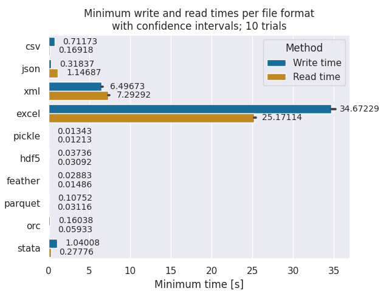
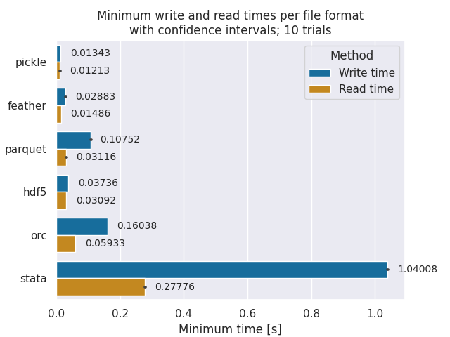
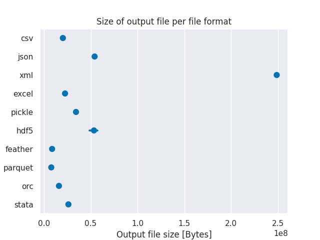
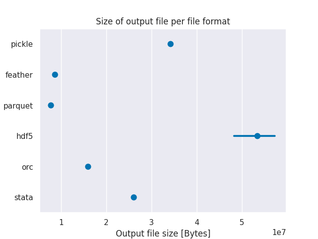

# Pandas File Format Benchmarking

*This repo is based on @tomaztk great work in [Benchmarking file formats for cloud Storage](https://github.com/tomaztk/Benchmarking-file-formats-for-cloud).*

This repo provides the `format_benchmark_tool` python module.
It is used to compare various [pandas file formats](https://pandas.pydata.org/docs/user_guide/io.html).

## Supported file formats

- `.csv`
- `.json`
- `.xml`
- `.xlsx` (Excel)
- `.pkl` (Pickle)
- `.h5` (HDF5)
- `.feather`
- `.parquet`
- `.orc`
- `.dta` (Stata)

## Getting Started

For ease of use we provide a simple Jupyter Notebook benchmarking all supported file formats and generating pretty graphs.

## Results

Results are based on experiments with multiple datasets from RoboCup 2D Simulation league recordings (≅20MB csv data).

| Format    | Read time Rank    | Write time Rank   | File Size Rank    | Type      | Language Support                  | Notes                     |
|-----------|-------------------|-------------------|-------------------|-----------|-----------------------------------|---------------------------|
| Pickle    | 1                 | 1                 | 7                 | binary    | Python                            |                           |
| Feather   | 2                 | 2                 | 2                 | binary    | Python, R, Julia, JS              | May not be stable         |
| Parquet   | 3                 | 4                 | 1                 | binary    | Python, Java, C++, PHP, JS, ...   |                           |
| HDF5      | 4                 | 3                 | 8                 | binary    | Python, C, C++, Java, ...         |                           |
| Orc       | 5                 | 5                 | 3                 | binary    | Python, Java, C++                 |                           |
| Csv       | 6                 | 7                 | 4                 | text      | UNIVERSAL                         |                           |
| Stata     | 7                 | 8                 | 6                 | binary    | Stata, Python (Pandas)            | Limited data type support |
| Json      | 8                 | 6                 | 9                 | text      | UNIVERSAL                         |                           |
| Xml       | 9                 | 9                 | 10                | text      | UNIVERSAL                         |                           |
| Excel     | 10                | 10                | 5                 | text      | UNIVERSAL                         |                           |
